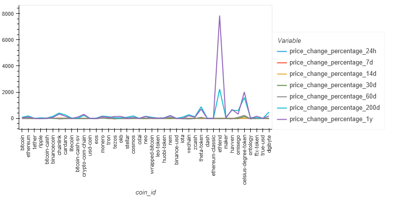
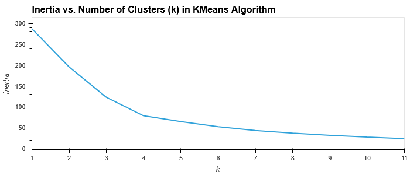
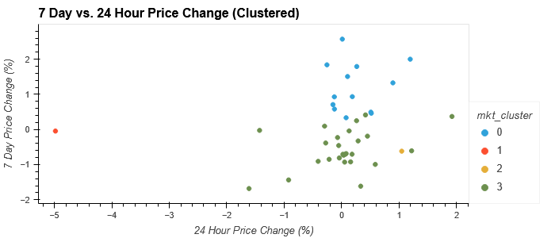
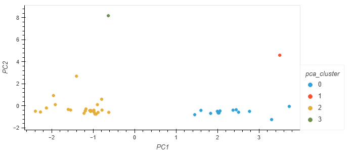
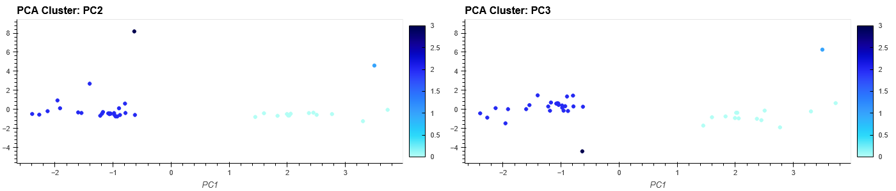

# 10_KMeans_Clusters
Cluster cryptocurrencies by their performance over different time periods using the KMeans algorithm.

<!-- **The application is published [here](http://rdillens.github.io/10_KMeans_Clusters) as a github project page, try it yourself!** -->

---
## Installation Instructions
- ### Install [Selenium](https://selenium-python.readthedocs.io/) to use [bokeh.io](https://docs.bokeh.org/en/latest/) image export functions
```shell
conda install selenium
```
and
```shell
conda install -c conda-forge firefox geckodriver
```
- ### To publish this notebook as HTML use [Voila](https://voila.readthedocs.io/en/stable/index.html):
```shell 
conda install -c conda-forge voila
```

---
## Usage
To run the notebook from the command line use:
```shell
voila crypto_investments.ipynb
```
<!-- 

 -->

---
## Examples
- ### Cryptocurrency market data

- ### Elbow plot to determine best number of KMeans Clusters

- ### Cluster plot of market data

- ### Cluster plot of Principal Component Analysis

- ### Subplots of Principal Component Analysis axes


---
## Contributors
Starter code was given in the Rice FinTech Bootcamp and all modifications were made by Remy Dillenseger.

---
## License
This project is licensed under the MIT License.
[Click Here](https://github.com/rdillens/10_KMeans_Clusters/blob/main/LICENSE) for more information.